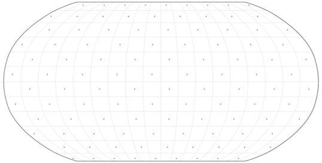

# Meshlands - An Exotic Configuration

## 1. Description
This project is the result of a research internship in the Computational Climate Research Group of the University of British Columbia under the supervision of Assistant Professor **Marysa M. Laguë**. The purpose of this research is to understand and analyze the impact of the continental configuration alone on local and remote climate.\
\
Meshlands correspond to an exotic and idealized configuration in which the planet surface is divided into a chessboard-like pattern alternating land cells and ocean cells of equivalent size.\
\
The following figure shows an example of Meshlands with ocean cells being highlighted by blue dots.

<div align="center">
  
  <p><em>Figure 1 : Meshlands example (Mesh16)</em></p>
</div>

## 2. Context
Based on a previous study that introduced the concept of Meshlands without further development (Laguë MM, Quetin GR, Ragen S, Boos WR. [*Continental configuration controls the base-state water vapour greenhouse effect: lessons from half-land, half-water planets*](https://link.springer.com/10.1007/s00382-023-06857-w)), we aim here to bring deeper knowledge about the impact of continental configuration on climate.\
\
The climate is the result of a multitude of interactions and processes among different variables. In order to isolate a certain variable without being biased by other changes, we conducted several experiments on Meshlands with varying patch size, while maintaining the same land-ocean ratio and the same configuration for each grid cell.\
\
However, Meshlands being a quite new concept, the project is very exploratory and must answer a general question:
<div align="center">
    
***How does land-ocean patch size influence global atmospheric circulation and moisture organization?***

</div>

## 3. Data & Model
### 3.1 Model used
We use the Community Earth System Model (CESM2) that allows a coupling between specific components via the CIME2 coupler. The active components used are the Community Atmosphere Model (CAM6) and the Community Land Model (CLM5). Otherwise, the ocean model is a slab, and the other components (River Runoff, Land Ice, and Ocean Wave models) are stubs, which means that they only serve as placeholders to satisfy interface requirements.\
\
More precisely, the compset used in these experiments is:
<div align="center">

***1850_CAM60_CLM50%SP_CICE_DOCN%SOM_SROF_SGLC_SWAV***

</div>

- **1850** → atmospheric conditions of the year 1850, the carbon dioxide has however been changed to satisfy experiments requirements, from 287.4 ppm to 450 ppm.
- **CAM60** → use of the Community Atmosphere Model version 6
- **CLM50%SP** → use of the Community Land Model version 5, with a satellite phenology specification
- **CICE** → Sea-Ice model component version 5
- **DOCN%SOM** → Slab ocean model
- **SROF**, **SGLC**, and **SWAV** → Stub models

### 3.2 Simulations
Three experiments have been realized: *Mesh4*, *Mesh8*, and *Mesh16*.\
\
Each experiment corresponds to a different patch size, Mesh4 being roughly 4-degree-wide patches, Mesh8 being roughly 8-degree-wide patches, and Mesh16 being roughly 16-degree-wide patches. The width of continents and oceans is approximate, given that the resolution is approximately 1 degree.\
\
In terms of atmospheric configuration, the aerosols play a crucial role in climate organization, but they cannot be used directly as they are initially organized in relation to the realistic Earth. To avoid the presence of dust and aerosol blobs that would not be coherent, we calculate a mirrored zonal mean to reflect the symmetry that exists in the Meshlands experiments.\
\
Finally, simulations are analyzed over a 30-year range after deleting the first 30 years of spin-up, using the Python language in a Jupyter Notebook.

## 4. Project folder

```
cesm_meshlands_study/
├── notebooks/
│   ├── Clouds_vf.ipynb
│   ├── Flux_vf.ipynb
│   ├── Habitability_vf.ipynb
│   ├── Hadley_vf.ipynb
│   ├── Humidity_vf.ipynb
│   ├── PET_vf.ipynb
│   ├── Precipitation_vf.ipynb
│   ├── Temperature_vf.ipynb
│   └── Wind_vf.ipynb
├── Figures/
├── Results/
│   └── article.pdf
├── environment.yml
└── README.md
── data/ does not exist because they are contained in a local cluster from the university
```

**Notebooks description**
- *Clouds_vf.ipynb* → contains all the important plots that are linked to the cloud repartition and radiative effect.
  
- *Flux_vf.ipynb* → contains plots that serve to analyze the radiative changes in climate when implementing a Meshland configuration.
  
- *Habitability_vf.ipynb* → contains a study of Meshland's habitability based on simple conditions (surface temperature and precipitation). The point here is to study habitability on land, not in the oceans that are more easily habitable than land.
  
- *Hadley_vf.ipynb* → contains meridional stream function plots representing the Hadley cell, the Ferrel cell, and the Polar cell, to determine the differences between patch sizes in terms of atmospheric circulation.
  
- *Humidity_vf.ipynb* → contains the moisture-related plots such as soil moisture, total precipitable water, specific humidity, etc. The humidity being one of the main elements studied in our project, this notebook shows the main results used in the article.
  
- *PET_vf.ipynb* → contains a realization of the Budyko Curve showing the relationship between the **evaporative index** and the **dryness index**. Concretely, the plots from this notebook serve to display the relative humidity or aridity contained in a grid cell.
  
- *Precipitation_vf.ipynb* → contains precipitation-related plots.
  
- *Temperature_vf.ipynb* → contains temperature-related and sea-ice-related plots.
  
- *Wind_vf.ipynb* → contains the main results in terms of atmospheric circulation, atmospheric heat transport, and atmospheric water transport.

## 5. Authors & Contact

Maël RODRIGUES, INSA Lyon, mael.rodrigues@insa-lyon.fr / mael.rodrigues@etu.isae-ensma.fr\
Marysa M. LAGUË, Computational Climate Research Group, Dpt. of Geography, University of British Columbia, marysa.lague@ubc.ca